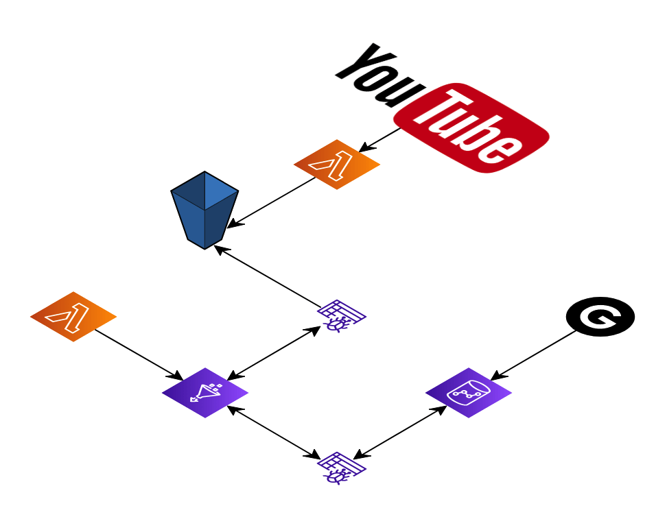
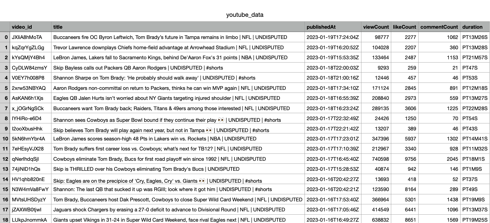

# YouTube API Data Pipeline


[My Project](https://datastudio.google.com/reporting/50b074b7-5c59-4538-8d03-d1e2318e4839)

## Prerequisites
* [Google account](https://accounts.google.com/signup)
* [AWS account](https://aws.amazon.com/console/)
* [Python](https://www.python.org/downloads/)
* [VSCode](https://code.visualstudio.com/download)

#### What we're doing

* Getting API key and reading data from YouTube API
* Converting data to CSV and uploading to S3
* Creating glue job that crawls CSV file in S3 bucket and writes it to Redshift DB
* Create Lambda function that runs Glue Job on S3 uploads
* Google Digital Studio creates dashboard with Redshift connection

## Getting YouTube API
* Navigate to the [developer's console](https://console.developers.google.com/) and log in if you haven't already.
* Click 'Create Project' and name your project then click create
* On the APIs & Services console, click 'Enable APIs & Services'
* Search 'YouTube' and click 'YouTube Data API V3' and enable
* On the left hand side, click 'Credentials' then 'Create Credentials'
* Click 'API Key' and save API key

Open VSCode and create a python file and import the following modules:


```python
import requests
from googleapiclient.discovery
import pandas as pd
import time
import boto3
import io
```

Import your API key and the channel ID for the channel you want to data from
You can find the channel ID by pasting the channel ID into this website [here](https://commentpicker.com/youtube-channel-id.php):
```python
channel_id = 'your_channel_id'
api_key = 'your_api_key'
```
Import service name and API version
Create API build
```ruby
api_service_name = "youtube"
api_version = "v3"

youtube = build(api_service_name, api_version, developerKey=api_key)
```
This function gets the data of the channel (name, subscribers, view count, video count):
```python
def get_channel_stats(youtube, channel_id):

    all_data = []
    request = youtube.channels().list(
        part='snippet,statistics,contentDetails',
        id='UCLXzq85ijg2LwJWFrz4pkmw'
    )
    response = request.execute()

    for item in response['items']:
        data = {'channelName': item['snippet']['title'],
                'subscribers': item['statistics']['subscriberCount'],
                'totalViews': item['statistics']['viewCount'],
                'totalVideos': item['statistics']['videoCount'],
                'playlistId': item['contentDetails']['relatedPlaylists']['uploads']
                }
        all_data.append(data)
    return pd.DataFrame(all_data)
channel_stats = get_channel_stats(youtube, channel_id)

print(channel_stats)
# Print returns channel name, subscriber count, total view count, total amount of videos, and the playlist ID.[
# Copy [playlistId] and save to variable playlist_id
```
This function gets the video ID:
```python
def get_vids(youtube, playlist_id):
    video_ids = []

    request = youtube.playlistItems().list(
        part='snippet,contentDetails',
        playlistId=playlist_id,
        maxResults = 50
    )
    response = request.execute()

    for item in response['items']:
        video_ids.append(item['contentDetails']['videoId'])
        
    next_page_token = response.get('nextPageToken')
    
    while next_page_token is None:
        request = youtube.playlistItems().list(
                part='contentDetails',
                playlistId = playlist_id,
                maxResults = 50,
                pageToken = next_page_token)
        response = request.execute()
    
        for i in range(len(response['items'])):
            video_ids.append(response['items'][i]['contentDetails']['videoId'])
        next_page_token = response.get('nextPageToken')

    return video_ids
video_ids = get_vids(youtube, playlist_id)
print(video_ids)
# Print returns the video IDs for the 50 most recent videos.
```
This function gets the video data for the 50 most recent videos:
```python
def get_video_details(youtube, video_ids): 
    all_video_info = []
    
    for i in range(0, len(video_ids), 50):
        request = youtube.videos().list(
            part="snippet,contentDetails,statistics",
            id=','.join(video_ids[i:i+50])
        )
        response = request.execute() 

        for video in response['items']:
            stats_to_keep = {'snippet': ['title', 'publishedAt'],
                             'statistics': ['viewCount', 'likeCount', 'commentCount'],
                             'contentDetails': ['duration']
                            }
            video_info = {}
            video_info['video_id'] = video['id']

            for k in stats_to_keep.keys():
                for v in stats_to_keep[k]:
                    try:
                        video_info[v] = video[k][v]
                    except:
                        video_info[v] = None

            all_video_info.append(video_info)


        #print(all_video_data)
        return pd.DataFrame(all_video_info)
        print(all_video_data)
video_df = get_video_details(youtube, video_ids)
print(video_df)
# Prints the title, date published, view count, like count, comment count, and duration of the 50 most recent videos.
```

## Use pandas DataFrame to convert ```video_df``` to a CSV file.
```ruby
video_df = get_video_details(youtube, video_ids)
video_df.to_csv('youtube_data.csv')
```


Upload CSV file to Amazon S3:
```python
s3_resource = boto3.resource('s3')
s3_resource.Object(bucket, 'youtube_data.csv').put(Body=csv_buffer.getvalue())
```
## Creating AWS Glue crawlers

